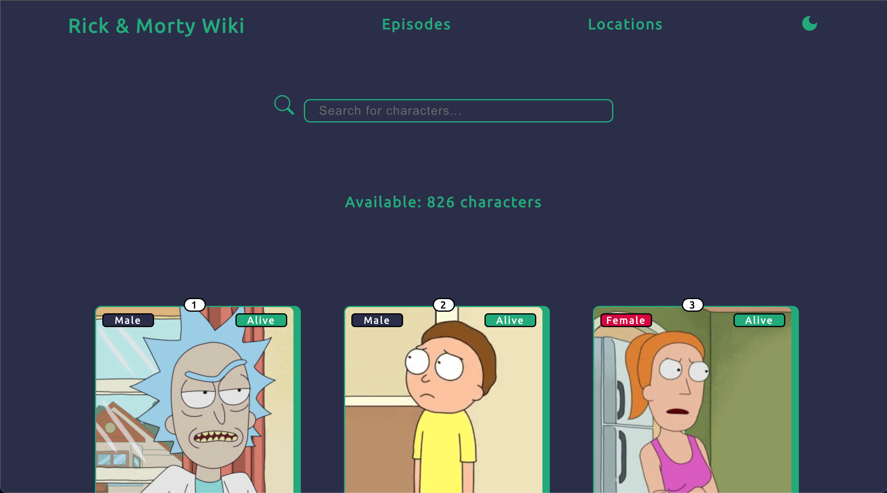

<br/>
<p align="center">
  <a href="https://github.com/davidperjac/rick-morty-wiki">
    
  </a>

  <h3 align="center">Rick and Morty Wiki</h3>

  <p align="center">
    Explore the bizarre and hilarious world of Rick and Morty like never before
    <br/>
    <br/>
    <a href="https://davidperjac.github.io/rick-morty-wiki">View Demo</a>
  </p>
</p>

  

## Table Of Contents

* [About the Project](#about-the-project)
* [Built With](#built-with)
* [Getting Started](#getting-started)
  * [Installation](#installation)
* [Usage](#usage)
* [Authors](#authors)

## About The Project

This is a comprehensive Rick and Morty wiki built using React. The wiki serves as a hub for fans of the show, providing in-depth information on characters, episodes, locations from the multiverse.

The wiki features a clean and intuitive user interface that allows users to easily navigate through the vast amount of information available.

The main goal of this project was to practice:
- Consuming an API service
- Custom Hooks
- Dark Mode styles
- Route navigation

## Built With

This application was built with:

* [React](https://es.react.dev/)
* [SCSS](https://sass-lang.com/)
* [Rick and Morty API](https://rickandmortyapi.com/)
* [React Router DOM](https://reactrouter.com/en/main)

## Getting Started

To use this application, simply clone the repository, install the dependencies, and start the development server. Here are the steps:

### Installation

1. Clone the repo

```sh
git clone https://github.com/davidperjac/rick-morty-wiki.git
```

2. Install NPM packages

```sh
npm install
```

3. Start the development server

```
npm start
```

4. Open your browser on `http://localhost:3000`

## Usage

- Comprehensive database of characters, locations and episodes from the show


- Intuitive search and filtering functionality


- Dark Mode design



## Authors

* **David Perez** - *FullStack Developer* - [David Perez](https://github.com/davidperjac) - *App*
